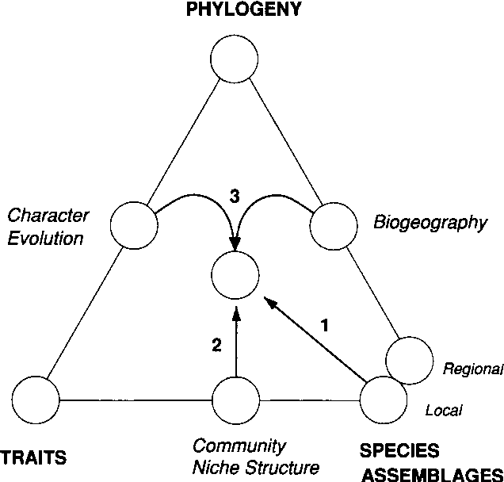
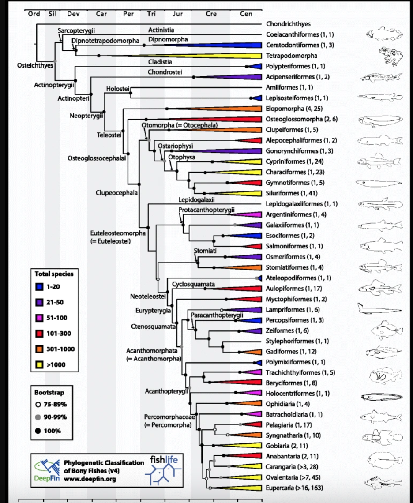

class: inverse, center, middle

# FishPhyloMaker

## An R package to generate phylogeny for bony fishes


.large[Gabriel Nakamura | LEFF meeting | `r Sys.Date()` ]


---

# Phylogenies in Ecology

.pull-left[

Cam Webb


]

.pull-right[

- Understand character evolution

- Community assembling mechanisms

- Historical factors associated with community assembly



]

---

# Let´s use phylogenetic trees in ecological studies


.pull-left[

## Back to 2012

- There was a master thesis to be done

- This thesis needed a phylogeny

- More precisely, a fish phylogeny

- So, let's pick a phylogeny

]

--

.pull-right[


.center[It will be ease]

]

---

# And then, let's pick a phylogeny

.pull-left[

### The first comprehensive fish phylogeny was [Betancur-R, 2017](https://bmcecolevol.biomedcentral.com/articles/10.1186/s12862-017-0958-3)

.center[

```{r eval=TRUE, echo=FALSE, out.width="70%"}

```

]

]

--

.pull-right[

### Then, let's do what ecologists like to do

.midle[

.center[

```{r xaringan-editable-1, echo=FALSE}
xaringanExtra::use_editable()
```

.can-edit[

((Cichlasoma_paranaense:43.65148501,Crenicichla_britskii:43.65148494):133.8257517,((((Ancistrus_pirareta:66.43187279,Ancistrus_reisi:66.43187272):27.3886498,((Curculionichthys_insperatus:42.59221138,Hypostomus_iheringii:42.59221131):8.661809897,Loricaria_luciae:51.25402127):42.56650131):22.23951779,(Bryconamericus_exodon:59.41152614,Astyanax_lacustris:59.41152616):56.64851415):8.34683831,Gymnotus_inaequilabiatus:124.4068786):53.07035805);

]

]

]

]

]

---

# We have a phylogeny **but**...

- Species in the specie spool are absent from the most comprehensive phylogeny (Darwinian shortfall)

.center[
```{r eval=TRUE, echo=FALSE, out.width="70%", out.height="70%"}

```
]

--

- We work with a lot of data

--

-  We need to insert them **e.g.** Phylomatic for plant species

---

# But, wait! we are talking about fishes 🐟

.pull-left[

### Problems

- Lack of a comprehensive phylogeny *specially in the tropical region*

- Lack of an "fish Phylomatic" 

]

--

.pull-right[

### Solutions

- Construct a comprehensive phylogeny using molecular tools
  - Expensive;
  - Available only for few groups e.g. 

*OR*

- Make it "by-hand" 

]

---

# Finding for solutions

.pull-left[
- Ok, We don´t have money
.center[

```{r echo=FALSE, eval=TRUE, out.width="70%", out.height="70%"}
knitr::include_graphics(path = "Figs/money-michaelscott.gif")
```

]

- I only live once, and the life is too short to edit newick files "by hand"
.center[

```{r echo=FALSE, eval=TRUE, out.width="70%", out.height="70%"}
knitr::include_graphics(path = "https://media.giphy.com/media/xT5LME4JUdxhiGQl4Q/giphy.gif")
```

]

]

--

.pull-right[

### Did you ever try to edit by-hand newick files? Take a shot..

```{r xaringan-editable, echo=FALSE}
xaringanExtra::use_editable()
```
.can-edit[

((Cichlasoma_paranaense:43.65148501,Crenicichla_britskii:43.65148494):133.8257517,((((Ancistrus_pirareta:66.43187279,Ancistrus_reisi:66.43187272):27.3886498,((Curculionichthys_insperatus:42.59221138,Hypostomus_iheringii:42.59221131):8.661809897,Loricaria_luciae:51.25402127):42.56650131):22.23951779,(Bryconamericus_exodon:59.41152614,Astyanax_lacustris:59.41152616):56.64851415):8.34683831,Gymnotus_inaequilabiatus:124.4068786):53.07035805);

]

]

---

# Finding for solutions

## We need a reproducible science

- Work directly on newick file brings some (many) problems, for example: 

--

  - How phylogeny was edited?

--

  - How species was added?

--

  - How can I obtain the same phylogeny that **you** made?

---
class: inverse, center, middle

# Get Started
```{r echo=FALSE, eval=TRUE}
knitr::include_graphics(path = "Figs/Logo_FishPhyloMaker.png", dpi = 700)
```

---

# What **FishPhyloMaker** solve?


- Produce phylogenetic trees for any assemblage of finned-ray fishes in a reliable and fast way

--

- Provide a fully reproducible method for the obtention of phylogenetic trees

--

- Allows to check for valid names of species

--

- Provides the first measure of Darwinian shortfalls

---

# General anatomy of FishPhyloMaker

.center[
Backbone phylogeny
```{r echo=FALSE, eval=TRUE, highlight=TRUE, out.width="60%", out.height="60%"}
knitr::include_graphics(path = "Figs/Fishtreeoflife.png")
```

]

.center[

**+**

]

.center[
Validate scientific names
```{r echo=FALSE, eval=TRUE, highlight=TRUE, out.width="60%", out.height="60%"}
knitr::include_graphics(path = "Figs/Fishbase.png")
```
]

---

# General anatomy of FishPhyloMaker

```{r echo=FALSE, eval=TRUE, highlight=TRUE, out.width="200%", out.height="200%"}
knitr::include_graphics(path = "Figs/Fig1_SchematicFig_procedure.png")
```

---

# Fishing the *Fish**Phylo**Maker*

To install `FishPhyloMaker` package from [Github](https://github.com/GabrielNakamura/FishPhyloMaker):

```{r eval=FALSE, echo=TRUE}
remotes::install_github("GabrielNakamura/FishPhyloMaker", 
                        force = TRUE, 
                        build_vignettes = TRUE)
```

--

After installation we recommend to relaunch RStudio.

--

Now, let the fish swim

```{r eval=FALSE, echo=TRUE}
library(FishPhyloMaker)
```

---

# Inside the *Fish[PhyloMaker]*

## FishPhyloMaker package has 3 main functions
  `FishTaxaMaker()`: Check species names accordingly to [FishBase]()
  
  `FishPhyloMaker()`: Generate phylogenetic tree
  
  `DarwinianShortfall()`: Calculates the amount of PD due to Darwinian Shortfalls
$$
PDdefict = PDinserted/PDinserted + PDpresent
$$
    
---

# Inside the *Fish[PhyloMaker]*

## Obtaining a taxon table

Let´s use a dataset present in the package

```{r xaringan-panelset1, echo=FALSE, eval=TRUE}
xaringanExtra::use_panelset()
```

.panelset[
.panel[.panel-name[Code automatic]
```{r echo=TRUE, eval=TRUE, highlight=TRUE}
library(FishPhyloMaker)
data(neotropical_comm)
data_comm <- neotropical_comm[, -c(1, 2)] # removing latitude and longitude
data <- FishPhyloMaker::FishTaxaMaker(data_comm, allow.manual.insert = FALSE)
# or...
# data <- FishPhyloMaker::FishTaxaMaker(data_comm, allow.manual.insert = TRUE)
```
]

.panel[.panel-name[Table automatic]
```{r echo=FALSE, eval=TRUE, out.height= "70%", out.width= "100%"}
DT::datatable(data$Taxon_data_FishPhyloMaker)
```
]

.panel[.panel-name[Code manual]
```{r echo=TRUE, eval=FALSE}
data_manual <- FishPhyloMaker::FishTaxaMaker(data_comm, 
                              allow.manual.insert = TRUE)
Characidae
Characiformes
Characidae
Siluriformes
Characidae
Characiformes
Cichlidae
Cichliformes
Caracidae
Characiformes
Gymnotidae
Gymnotiformes
Loricariidae
Siluriformes
Loricariidae
Siluriformes
Loricariidae
Siluriformes
Loricariidae
Siluriformes
Heptapteriidae
Siluriformes
Characidae
Characiformes
Loricariidae
Siluriformes
Characidae
Characiformes
```

]

.panel[.panel-name[Table Manual]
```{r echo=FALSE, eval=TRUE}
data_manual <- read.table("table_manual.txt", header = TRUE)
```

```{r echo=FALSE, eval=TRUE}
DT::datatable( data_manual, height = 500)
```

]

]
---

# Inside The *Fish[PhyloMaker]*

## Generating a phylogeny for a local pool of species

Finally we can generate a phylogenetic tree with `FishPhyloMaker` function

```{r xaringan-panelset, echo=FALSE, eval=TRUE}
xaringanExtra::use_panelset()
```

.panelset[
.panel[.panel-name[R Code]
```{r echo=TRUE, eval=FALSE}
phylo_fish_streams <- FishPhyloMaker(data = data_manual$Taxon_data_FishPhyloMaker, 
                                     return.insertions = TRUE,
                                     insert.base.node = TRUE, 
                                     progress.bar = TRUE)
```
]

.panel[.panel-name[Plot]
```{r echo=FALSE, eval=TRUE, out.width="60%"}
knitr::include_graphics(path = "Figs/phylogeny_fishphylomaker.png")
```
]

.panel[.panel-name[Table insertions]
```{r echo=FALSE, eval=TRUE}
insertions <- read.table("table_insertion.txt", header = TRUE)
```

```{r echo=FALSE, eval=TRUE}
DT::datatable(insertions, height = 20)
```

]

]
---

# Phylogenetic tree with many insertions 

.center[
```{r echo=FALSE, eval=TRUE, out.width="80%", out.height="80%"}
knitr::include_graphics(path = "Figs/Fig_phyloEcoregions.png")
```
]

---

# Darwinian showrfalls

.center[

```{r echo=FALSE, eval=TRUE, out.width="100%", out.height="100%"}
knitr::include_graphics(path = "Figs/world_map.png")
```

$$
PDdefict = PDinserted/PDinserted + PDpresent
$$
]

---

# Advances that FishPhyloMaker bring

1- Reliable and fast way to obtain phylogenies for ray-finned fishes

2- Quantify Darwinian shortfalls


--

# Next steps

.center[
Expand the package for other taxa
]

---
class: inverse, middle, center

# More information

[FishPhyloMaker website](https://gabrielnakamura.github.io/FishPhyloMaker/)
.center[
```{r echo=FALSE, eval=TRUE, out.width="100%", out.height="100%"}
knitr::include_graphics(path = "Figs/website-fishphylo.png")
```

]
